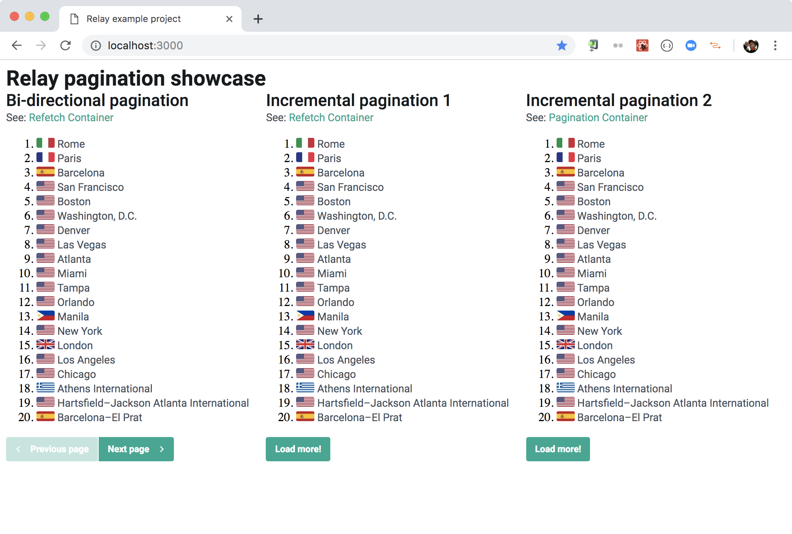
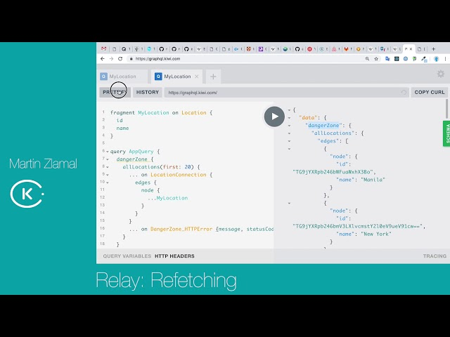
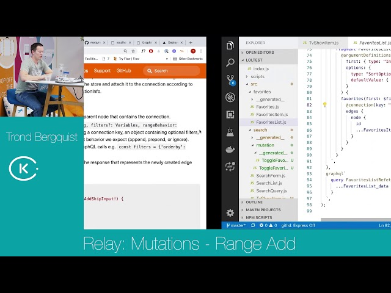
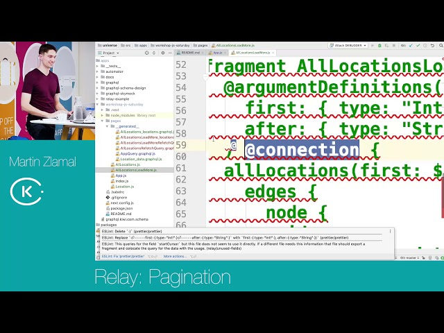
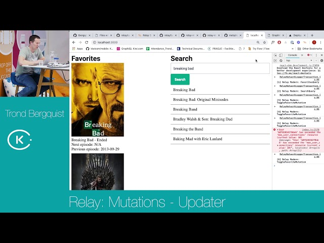
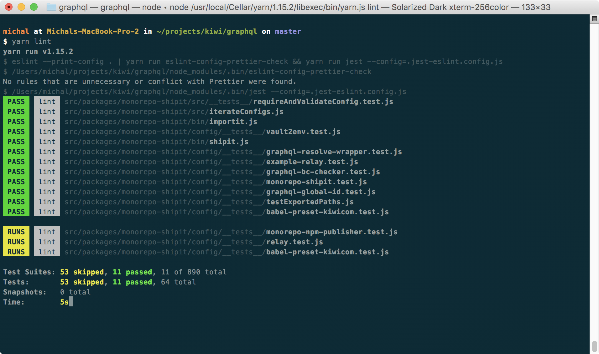

autoscale: true
theme: Ostrich, 6


<br />
# [fit] Multiplatform UI
## __Michal Sänger__
__`michal.sanger@kiwi.com`__

---

#[fit] Kiwi.com __wants to__<br /> make travel better

---


---


---

 

---

 

---

#[fit] __3__ platforms<br />__3 FE__ teams<br />__3 isolated__ islands

---

#[fit]__New project__<br />margarita__.kiwi.com__

---


---

#[fit] __Opensource__<br /> <br />[__github.com__/kiwicom/margarita](https://github.com/kiwicom/margarita)

---

# We handle
- backend
- payments
- customer support

---

# You enjoy
- GraphQL
- Multiplatform UI components
- Profit

---

#[fit] __How to__<br />Multiplatform UI

---

#[fit] React Native __first__

---

#[fit] React Native Web<br />__for browser__

---


---

#[fit] __Rework__ [https://orbit.kiwi](https://orbit.kiwi)


---

#[fit] __Shared__ UI<br />__Shared__ know-how

---

#[fit] __Multiplatform Orbit__<br />NPM package __soon™__

---

#[fit] [margarita__.kiwi.com__](https://margarita.kiwi.com)<br /> <br />[__github.com__/kiwicom/margarita](https://github.com/kiwicom/margarita)

---

#[fit] Learn __Relay__<br /> <br />[__github.com__/kiwicom/relay-example](https://github.com/kiwicom/relay-example)

---
# Learn Relay

- GraphQL fragments
- simple fetching
- Endless pagination
- bi-directional pagination

---



---

# Relay talks





---

#[fit] __Better Fetch library__<br /> <br />[@kiwicom/fetch](https://www.npmjs.com/package/@kiwicom/fetch)

---

# Kiwi Fetch

- Retries
- Timeouts
- Error handling

---

# Fetch - timeout, retries

```js
import fetchWithRetries from '@kiwicom/fetch';

fetchWithRetries(
  'https://example.api',
  {
    fetchTimeout: 15000,
    retryDelays: [1000, 3000],
    // ... standard Fetch options
  },
);

```

---

# Fetch - error handling

```js
import fetchWithRetries, { TimeoutError, ResponseError } from '@kiwicom/fetch';

try {
  const response = await fetchWithRetries('//localhost');
} catch (error) {
  if (error instanceof TimeoutError) {
    console.error('request timeouted');
  } else if (error instanceof ResponseError) {
    console.error('unsuccessful response', error.response);
  } else {
    console.error('unknown error');
  }
}
```

---


#[fit] __Opinionated ESlint rules__<br /> <br />[@kiwicom/eslint-config](https://www.npmjs.com/package/@kiwicom/eslint-config)

---
# Kiwi ESlint config

- React, RN, Hooks, Relay
- Prettier, Jest
- Flow, Node
- extendable

---

# ESlint - setup

```js
//.eslintrc.js
module.exports = {
  root: true,
  extends: [
    '@kiwicom/eslint-config',
  ],
};
```

---

# ESLint runner

- Parallel execution
- Only changed files
- Auto fix

---



---

#[fit] __Babel Preset__<br /> <br />@kiwicom/babel-preset-kiwicom

---

# Babel Preset

- Flow, JSX
- Class properties
- Relay fragments
- Syntactic sugar

---

#[fit] [__github.com__/kiwicom](https://github.com/kiwicom/)
