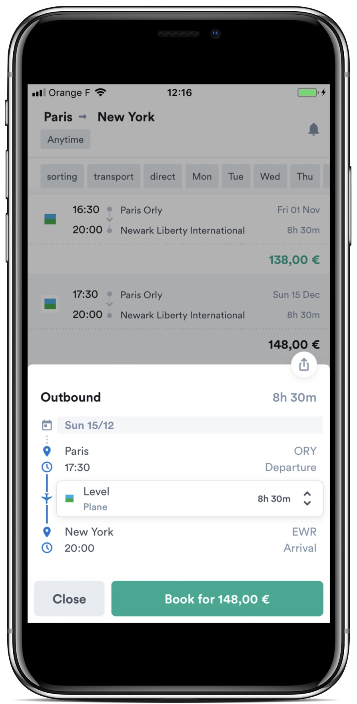
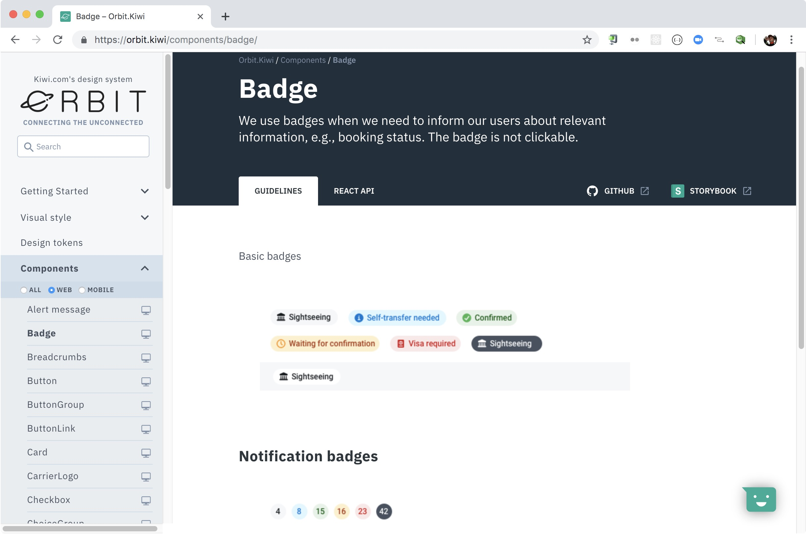

autoscale: true
theme: Ostrich, 6

# [fit] Multiplatform UI
## __Michal Sänger__
__`michal.sanger@kiwi.com`__

---

#[fit] Kiwi.com __wants to__  make travel better

---

---

 

---

 

---

---

#[fit] __3__ platforms __3 FE__ teams __3 isolated__ islands

---

#[fit]__New project__ margarita__.kiwi.com__

---

---

#[fit] __Opensource__ [__github.com__/kiwicom/margarita](https://github.com/kiwicom/margarita)

---

# We handle
- backend
- payments
- customer support

---

# You enjoy
- GraphQL
- Multiplatform UI components
- Profit

---

#[fit] __How to__ Multiplatform UI

---

#[fit] React Native __first__

---

#[fit] React Native Web __for browser__

---

---

#[fit] __Rework__ [https://orbit.kiwi](https://orbit.kiwi)

---

#[fit] __Shared__ UI __Shared__ know-how

---

#[fit] __Multiplatform Orbit__ NPM package __soon™__

---

#[fit] [margarita__.kiwi.com__](https://margarita.kiwi.com)   [__github.com__/kiwicom/margarita](https://github.com/kiwicom/margarita)
