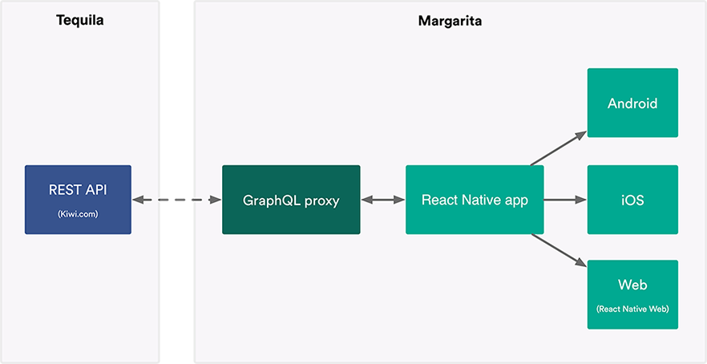
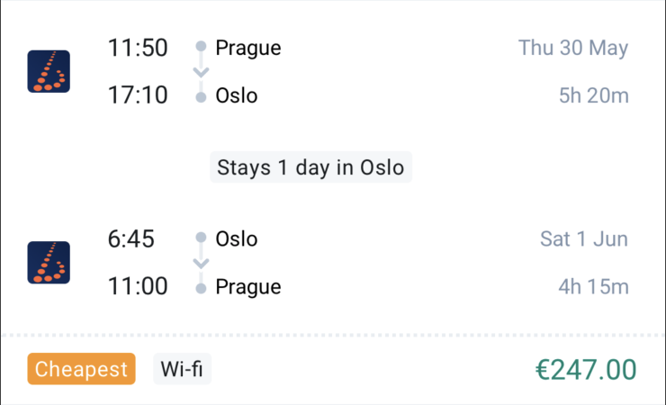

autoscale: true
theme: Ostrich, 6


<br />
# [fit] Multiplatform UI
## __Michal Sänger__
__`michal.sanger@kiwi.com`__

^
- UI components that you write once and use across multiple platforms is an interesting topic.
- What are the benefits from customer POV?
- Is the technology ready?
- How does it affect project management?
- I'll try to answer these questions in my short talk
- My name is Michal, I work in Kiwi.com in Prague, Czech republic

---

#[fit] Kiwi.com __wants to__<br /> make travel better

^
- In Kiwi.com we want to make the travel better!
- How do we want to make it better?

---


^
- ... by delivering useful features to all platforms our customers use.

---


---

 

---

 

---

#[fit] __3__ platforms<br />__3 FE__ teams<br />__3 isolated__ islands

---

#[fit]__New project__<br />margarita__.kiwi.com__

---


^
- It's a showcase application how integrate travel features into your product or how to build your own Kiwi.com
- It's also a chance for us to experiment with new technologies

---

#[fit] __Opensource__<br /> <br />[__github.com__/kiwicom/margarita](https://github.com/kiwicom/margarita)

^
It's opensourced since the first commit

---

# Margarita



---

# We handle
- backend
- payments
- customer support

---

# You enjoy
- GraphQL
- Multiplatform UI components
- Profit

---

#[fit] __How to__<br />Multiplatform UI

^
- How did we actually implement the Multiplatform UI?
- One could say we used two main libraries or approaches for that

---

#[fit] React Native __first__

---

#[fit] React Native Web<br />__for browser__

^
- ...we rendered those RN components with RNW
- but there is important product requirement. The customer has to have best possible UX
- Software engineer could see the job is done once the RN component is rendered in browser.
- UX designer has valid requirement to tweak the components on every platform to increase UX

---

# Platform tweaks

```js
<CarrierLogo
  size={Platform.OS === 'web' ? 'large' : 'medium'}
  carriers={carriers}
/>
```

---

# Platform tweaks

```js
const styles = StyleSheet.create({
  text: {
    ios: {
      color: 'pink'
    },
    android: {
      color: 'deepink'
    },
    web: {
      color: 'salmon'
    }
  }
});
```

---

# Platform tweaks

## *`ItineraryCard.native.js`*



---

# Platform tweaks

## *`ItineraryCard.web.js`*


---


^
This demo should prove the technology is ready

---

#[fit] __Shared__ UI<br />__Shared__ know-how

^
From project POV biggest benefits are
- sharing know-how
- smaller teams
- faster features delivery in sync

---

#[fit] __Rework__ [https://orbit.kiwi](https://orbit.kiwi)


^
During development of Margarita we picked components from our design system Orbit and rewrote them from React into React Native

---

#[fit] __Multiplatform Orbit__<br />NPM package __soon™__

---

#[fit] [margarita__.kiwi.com__](https://margarita.kiwi.com)<br /> <br />[__github.com__/kiwicom/margarita](https://github.com/kiwicom/margarita)

^
- Run the application and learn from the source code how was it build.
- Feel free to create an issue if anything is unclear or broken
- As I have some more time left, let me share few more interesting opensource projects we made

---

#[fit] Learn __Relay__<br /> <br />[__github.com__/kiwicom/relay-example](https://github.com/kiwicom/relay-example)

^
When you'll be checking the source code of Margarita, you will se it fetches data via GraphQL
We are using Relay FE framework this.
Lot of people use Apollo but we think Relay is better for bigger applications and it's good to learn it and use since beginning, later migration can be difficult.

---


^
We published small example project, build on Next.js
Focused on explaining few basic features and principals

---
# Learn Relay

- GraphQL fragments
- simple fetching
- Endless pagination
- bi-directional pagination

---

# Relay talks


---

#[fit] __Better Fetch library__<br /> <br />[@kiwicom/fetch](https://www.npmjs.com/package/@kiwicom/fetch)

^
When playing with Relay Example project, you can notice there is a handy fetch library being used

---

# Kiwi Fetch

- Retries
- Timeouts
- Error handling

^
We were missing some features in standard fetch libs, so we implemented them
The usage is simple

---

# Fetch - timeout, retries

```js
import fetchWithRetries from '@kiwicom/fetch';

fetchWithRetries(
  'https://example.api',
  {
    fetchTimeout: 15000,
    retryDelays: [1000, 3000],
    // ... standard Fetch options
  },
);

```

---

# Fetch - error handling

```js
import fetchWithRetries, { TimeoutError, ResponseError } from '@kiwicom/fetch';

try {
  const response = await fetchWithRetries('//localhost');
} catch (error) {
  if (error instanceof TimeoutError) {
    console.error('request timeouted');
  } else if (error instanceof ResponseError) {
    console.error('unsuccessful response', error.response);
  } else {
    console.error('unknown error');
  }
}
```

---

#[fit] __Opinionated ESlint rules__<br /> <br />[@kiwicom/eslint-config](https://www.npmjs.com/package/@kiwicom/eslint-config)

^
And when you gonna check source of our project, you will notice we keep them in consistent shape with our set of ESLint rules

---
# Kiwi ESlint config

- React, RN, Hooks, Relay
- Prettier, Jest
- Flow, Node

---

# ESlint - setup

```js
//.eslintrc.js
module.exports = {
  root: true,
  extends: [
    '@kiwicom/eslint-config',
  ],
};
```

^
Again it's very simple to use it
And it comes with a great bonus...

---

# ESLint runner

- Parallel execution
- Only changed files
- Auto fix

^
Big projects can take lot of time when there is a lot of rules in your config
Runner is build on Jest runner so it can run in parallel and check only files that were changed

---


---

#[fit] __Babel Preset__<br /> <br />[@kiwicom/babel-preset-kiwicom](https://www.npmjs.com/package/@kiwicom/babel-preset-kiwicom)

^
And of course we published also our Babel preset so everyone can write modern JS

---

# Babel Preset

- Flow, JSX
- Class properties
- Relay fragments
- Syntactic sugar

^
GraphQL fragments over fetching
Optional chaining

---

#[fit] [__github.com__/kiwicom](https://github.com/kiwicom/)

^
So the point basically is - check our Github, we have a lot of cool stuff there :-)

---

# Show your :heart:


^
And please when you are gonna be there, show your love and provide feedback
Give stars to projects you liked, create issues when you have some questions or even provide pull requests when you see how something could be improved

---

#[fit] One more thing...

---

#[fit] [summercamp.cz](https://summercamp.cz/)


^
We did it last year and it was fun
We provide transport, 1000 EUR voucher, accommodation, parties and tons of knowledge
Meet the guys who wrote the stuff I presented
All you have to do is register and pass the test we'll send you
